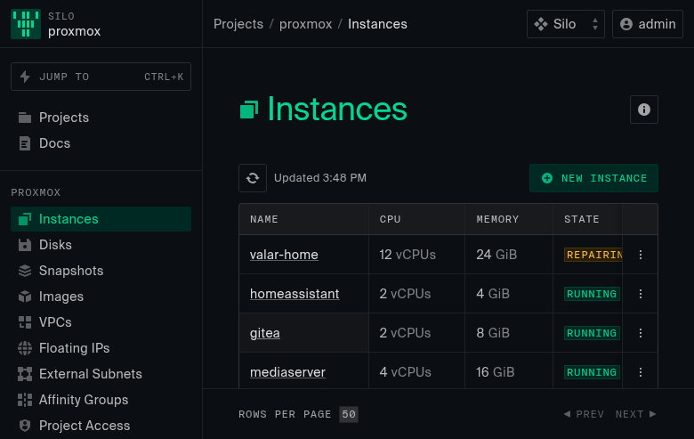

# oxidize

**Run [Oxide's Console](https://github.com/oxidecomputer/console) against a [Proxmox VE](https://www.proxmox.com/) cluster.**

oxidize is a single Go binary that serves the Oxide web console and implements
the slice of the Oxide ("Nexus") API the console needs, translating each request
to the Proxmox VE API on the fly. The result: Oxide's polished UI for managing
your Proxmox VMs, disks, snapshots, networking, and hardware.



## How it works

```
browser ──HTTPS──▶ oxidize ──┬──▶ embedded Oxide Console (static SPA)
                             └──▶ /v1/* Oxide API  ──translate──▶ Proxmox VE API
```

- The console is a pure SPA that calls a relative `/v1/...` API, so one process
  serves both the UI and the API on the same origin — no CORS.
- oxidize hand-implements the subset of the Oxide external API the console uses
  (`internal/oxide` types, `internal/server` handlers) and maps it to Proxmox
  (`internal/proxmox` client, `internal/translate` mappers).
- The console build is embedded into the binary with `go:embed`.

## Status

This is a pragmatic mapping between two different systems. Many things map
cleanly; some are synthesized; a few can't map at all (see
[Limitations](#limitations)).

| Area | Status |
|---|---|
| Login (single configured user) | ✅ works |
| Instances: list / detail / create (incl. **clone from template**) / start / stop / reboot / delete / resize | ✅ works |
| Disks: list / create / attach / detach / delete | ✅ works |
| Images: list (ISOs + VM templates) / delete | ✅ works (no upload) |
| Snapshots: list / create / delete (whole-VM) | ✅ works |
| Serial console (xterm over WebSocket) | ✅ works |
| Metrics (CPU %, disk & network bytes) | ✅ real (from Proxmox RRD) |
| Networking tab: NICs + external IPs (read) | ✅ mapped from `netN` + guest agent |
| Projects (from Proxmox **resource pools**, default project otherwise) | ✅ works |
| Hardware inventory: sleds↔nodes, physical disks | ✅ works |
| System utilization (provisioned totals) | ✅ works (flat — no history) |
| VPCs / subnets / IP pools | ⚠️ read-only synthetic singletons |
| Connect tab | ⚠️ known issue ("unable to find serial interface") |
| System Update view | ⛔ not implemented yet |
| Floating IPs, VPC firewall/routers, image upload, silos/RBAC, multi-user auth | ⛔ no clean Proxmox mapping |

## Requirements

- A Proxmox VE host/cluster and an **API token** (`USER@REALM!TOKENID=SECRET`).
- Go 1.24+ (to build the binary).
- Node 20.19+/22+ and npm (to build the console UI).
- The Oxide Console source in `./console` (see below) — it is **not** vendored
  in this repo.

## Build & run

```sh
# 1. Get the Oxide Console source (this repo expects it at ./console, gitignored)
git clone https://github.com/oxidecomputer/console console

# 2. Put your Proxmox API token in ./TOKEN
cat > TOKEN <<'EOF'
TOKEN_ID=root@pam!oxide
TOKEN_SECRET=xxxxxxxx-xxxx-xxxx-xxxx-xxxxxxxxxxxx
EOF

# 3. Build the UI (embeds console/dist) and the binary
make ui
make build

# 4. Run
OXIDIZE_USER=admin OXIDIZE_PASS=secret \
  ./bin/oxidize --proxmox-host https://your-proxmox:8006 --token-file ./TOKEN
```

Then open <http://localhost:8080> and log in.

## Configuration

Flags (or environment variables):

| Flag | Env | Default | Description |
|---|---|---|---|
| `--listen` | `OXIDIZE_LISTEN` | `:8080` | Listen address |
| `--proxmox-host` | `PROXMOX_HOST` | — | Proxmox base URL, e.g. `https://host:8006` |
| `--token-file` | `PROXMOX_TOKEN_FILE` | `TOKEN` | Path to the Proxmox API token file |
| `--insecure` | `PROXMOX_INSECURE` | `true` | Skip TLS verification (self-signed homelab certs) |
| `--data-dir` | `OXIDIZE_DATA_DIR` | `data` | File-backed state (SSH keys) |
| | `OXIDIZE_USER` / `OXIDIZE_PASS` | `admin`/`admin` | Console login |
| | `OXIDIZE_SESSION_SECRET` | random | HMAC key for the session cookie |

## Deployment

The `deploy/` directory + Makefile targets ship oxidize to a Linux host as a
systemd service, optionally fronted by Caddy with automatic Tailscale HTTPS.

```sh
make provision   # first-time: install the systemd unit + env template
make deploy      # cross-compile linux/amd64, ship the binary, restart the service
make release     # rebuild the UI, then deploy
make caddy       # install/refresh the Caddy reverse proxy (Tailscale HTTPS)
```

Targets connect over SSH (Tailscale SSH by default, as a non-root user via
`sudo`). Override the target/credentials:

```sh
make deploy DEPLOY_HOST=you@host SSH_OPTS="-i ~/.ssh/key" SUDO=sudo
```

**Tailscale HTTPS:** with Caddy 2.7+ and `TS_PERMIT_CERT_UID=caddy` on
`tailscaled`, the `deploy/Caddyfile` (`reverse_proxy localhost:8080`) gets a real
HTTPS cert for your `*.ts.net` name automatically — no manual cert/renewal. See
<https://tailscale.com/blog/caddy>.

## Limitations

oxidize bridges two systems with different models; the deep mismatches are:

- **External IPs / floating IPs / IP pools** — Proxmox has no concept of
  allocatable external IPs. A VM just gets bridged onto a network and whatever
  IP the guest obtains. oxidize surfaces the guest-agent-reported IP read-only.
- **VPC software-defined networking & firewall** — VPC/subnet are read-only
  synthetic singletons; Proxmox SDN is not used.
- **Silos / RBAC / multi-user auth** — single synthetic silo + single configured
  login. No users/groups/SAML/quotas.
- **Snapshots are whole-VM** (Proxmox has no per-disk snapshots).
- **Images** — ISOs and VM templates are listed and bootable/cloneable, but
  there's no image upload or promote/demote.
- **Metrics** — real, but coarse: whole-VM CPU%, byte-rate (labeled "Bytes")
  disk/network throughput; no IOPS/packet/latency series; Proxmox RRD retention.

Fundamentally, Oxide's control plane *owns* allocation (IPs, placement, quotas)
while Proxmox delegates that to the network and guests — so those Oxide concepts
are synthesized or flat here.

## Project layout

```
cmd/oxidize/        entrypoint
internal/oxide/     hand-written Oxide API types (snake_case wire shapes)
internal/proxmox/   typed Proxmox VE API client
internal/translate/ Proxmox ⇄ Oxide mappers
internal/server/    HTTP handlers / routing
internal/static/    go:embed of the built console
internal/store/     file-backed state (SSH keys)
deploy/             systemd unit, env example, Caddyfile
```

## License

oxidize's own code is [MIT](LICENSE). It builds and embeds the
[Oxide Console](https://github.com/oxidecomputer/console), which is © Oxide
Computer Company under the **MPL-2.0**; that license governs the embedded
console assets. oxidize is not affiliated with or endorsed by Oxide Computer
Company.
